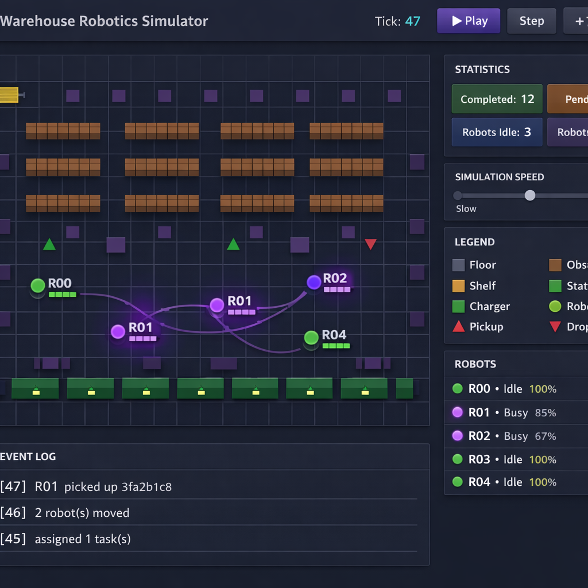

# Warehouse Robotics: Multi-Agent Path Planning & Task Allocation Simulator

A simulation framework for coordinating autonomous mobile robots in a fulfillment-center-style warehouse. Demonstrates core robotics software engineering concepts relevant to large-scale logistics automation.

## Screenshots

### Live Dashboard

*Real-time warehouse visualization with robot movement, path trails, task markers, statistics, and event log.*

### System Architecture

*Layered architecture: Canvas dashboard → FastAPI REST API → Core simulation engine (pathfinding, allocation, loop) → Domain models.*

### 42 Tests Passing

*Full test coverage across models, A\* pathfinding, CBS multi-agent coordination, task allocation, simulation lifecycle, and API endpoints.*

### Auto-Generated API Docs

*FastAPI's interactive Swagger UI with all 10 endpoints, request/response schemas, and "Try it out" functionality.*

---

## Key Features

| Component | Algorithm / Technology | Relevance |
|---|---|---|
| **Single-agent path planning** | A* search on 4-connected grid | Shortest path with obstacle avoidance |
| **Multi-agent path finding** | Conflict-Based Search (CBS) | Collision-free coordination of multiple robots |
| **Task allocation** | Hungarian algorithm (Kuhn-Munkres) | Optimal assignment minimizing total weighted cost |
| **Simulation engine** | Discrete-event tick-based loop | Full pickup → transport → dropoff lifecycle |
| **REST API** | FastAPI microservice | Real-time control & state queries |
| **Visualization** | Canvas-based web dashboard | Live robot movement, paths, battery, event log |

## Architecture

```
robotics/
├── warehouse/              # Core simulation package
│   ├── models.py           # Domain models (Warehouse, Robot, Task, Position)
│   ├── pathfinding.py      # A* planner + Conflict-Based Search (CBS)
│   ├── task_allocator.py   # Hungarian algorithm task assignment
│   └── simulator.py        # Orchestration engine
├── api/
│   └── main.py             # FastAPI REST API
├── static/
│   └── index.html          # Real-time visualization dashboard
├── tests/                  # 42 unit + integration tests
│   ├── test_models.py
│   ├── test_pathfinding.py
│   ├── test_allocator.py
│   ├── test_simulator.py
│   └── test_api.py
├── requirements.txt
└── README.md
```

## Quick Start

```bash
# Install dependencies
pip install -r requirements.txt

# Run the test suite (42 tests)
python -m pytest tests/ -v

# Start the API server with live dashboard
uvicorn api.main:app --reload

# Open the dashboard
# http://localhost:8000
```

## How It Works

### 1. Warehouse Environment
A grid-based environment with different cell types: floor, obstacles, shelves, stations (pickup/dropoff), and chargers. Robots navigate the grid avoiding obstacles and each other.

### 2. Path Planning - A* with Time-Aware Constraints
Single-agent optimal pathfinding using A* search on a 4-connected grid. Supports time-indexed constraint tables, enabling it to serve as the low-level solver inside CBS.

### 3. Multi-Agent Coordination - Conflict-Based Search (CBS)
Based on [Sharon et al., 2015](https://www.sciencedirect.com/science/article/pii/S0004370214001386). CBS finds optimal collision-free paths for all robots simultaneously by:
1. Planning each robot independently
2. Detecting vertex conflicts (two robots at the same cell at the same time)
3. Branching into constraint tree nodes, adding constraints that force one robot to avoid the conflict
4. Recursively resolving until all paths are collision-free

### 4. Task Allocation - Hungarian Algorithm
Constructs a cost matrix factoring in:
- **Distance**: Manhattan distance from robot to task pickup
- **Priority**: Higher-priority tasks receive lower cost (incentivizing assignment)
- **Battery**: Low-battery robots receive higher cost (discouraging assignment)

Uses `scipy.optimize.linear_sum_assignment` for O(n³) optimal bipartite matching.

### 5. Simulation Loop
Each tick:
1. **Allocate** - Assign pending tasks to idle robots
2. **Plan** - Compute collision-free paths via CBS (or A* fallback)
3. **Move** - Advance each robot one step along its path
4. **Handle arrivals** - Process pickups and dropoffs, update task states

## REST API Endpoints

| Method | Endpoint | Description |
|--------|----------|-------------|
| `GET` | `/` | Live visualization dashboard |
| `GET` | `/api/state` | Full warehouse state snapshot |
| `POST` | `/api/step?n=1` | Advance simulation by n ticks |
| `POST` | `/api/run?ticks=50` | Batch run with event summary |
| `POST` | `/api/task` | Create a task (pickup/dropoff coords) |
| `POST` | `/api/task/random` | Generate a random task |
| `POST` | `/api/robot` | Add a robot at a position |
| `POST` | `/api/reset` | Reset simulation with new config |
| `GET` | `/api/robots` | List all robots |
| `GET` | `/api/tasks` | List active tasks |

## Design Decisions

- **Immutable value objects** (`Position` is `frozen=True`) for safe use as dict keys and in sets
- **Clean state machine** for robot lifecycle: `IDLE → EN_ROUTE_PICKUP → EN_ROUTE_DROPOFF → IDLE`
- **Separation of concerns**: Models know nothing about algorithms; planner knows nothing about the API
- **CBS is optimal** for multi-agent pathfinding - guarantees minimum-cost collision-free solution
- **Graceful fallback**: If CBS exceeds its search budget, falls back to independent A* planning

## Testing

```bash
python -m pytest tests/ -v
```

**42 tests** covering:
- Domain model invariants and state transitions
- A* correctness: optimal paths, obstacle avoidance, constraint handling
- CBS: conflict resolution for 2-3 agents, head-on collision scenarios
- Task allocator: nearest-robot assignment, priority weighting, edge cases
- Simulator: task completion lifecycle, no-collision invariant
- API: all endpoints, input validation, reset behavior

## Technologies

- **Python 3.11+** - type hints, dataclasses, slots
- **FastAPI** - async REST API with auto-generated OpenAPI docs
- **NumPy / SciPy** - cost matrix construction and Hungarian algorithm
- **HTML5 Canvas** - real-time grid visualization with smooth rendering
- **pytest + pytest-asyncio + httpx** - async integration testing
